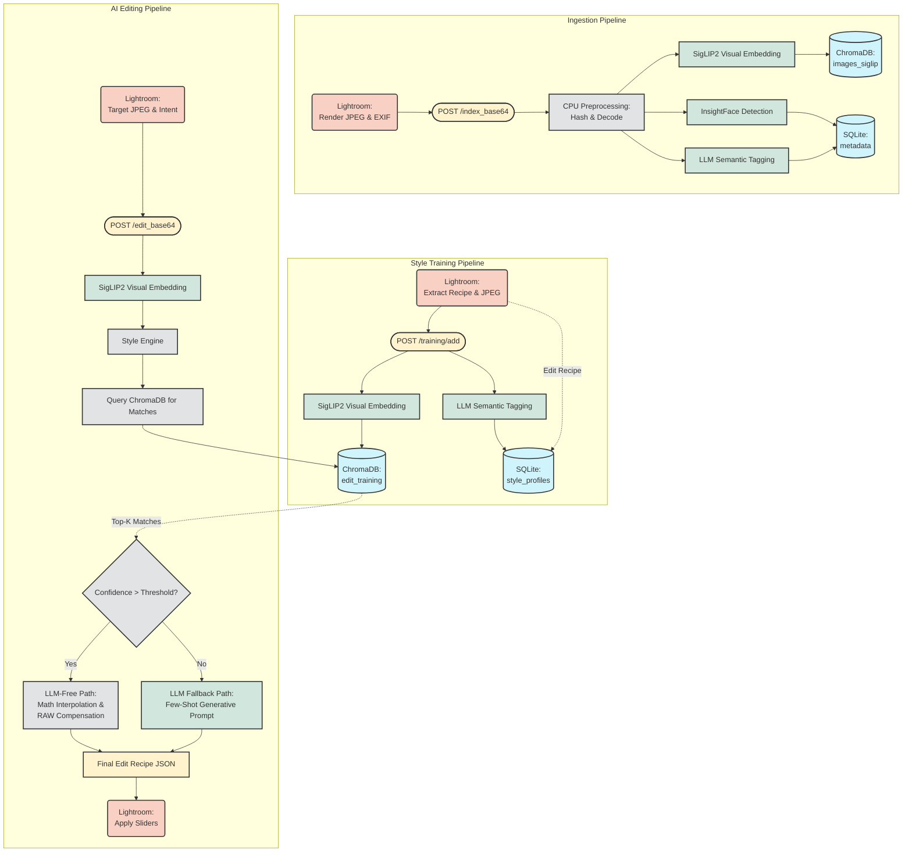

# StyleAI: Analysis & Editing Pipelines

This document outlines the core data pipelines in StyleAI, detailing how photos flow from Lightroom through our local and cloud AI models, what data is passed into them, and what they output.

## Visual Flowchart

---

## 1. Photo Analysis & Indexing Pipeline (Ingestion)

Triggered when a user imports or indexes photos (`TaskAnalyzeAndIndex.lua`). This pipeline builds the foundational search index and metadata repository.

### Data Flow & Stages
1. **Lightroom (Client)**: 
   - Renders a lightweight, temporary JPEG of the photo.
   - Extracts EXIF data (capture time, camera model, lens) and existing Lightroom keywords.
   - Sends this payload (Base64 JPEG + JSON metadata) to `POST /index_base64`.
2. **CPU Preprocessing (`services/index.py`)**: 
   - Background threads decode the JPEG, calculate a stable MD5 hash for deduplication, and prepare tensors.
3. **Local Visual Embedding (SigLIP2 via `services/clip.py`)**: 
   - **Input**: Preprocessed image tensor.
   - **Output**: 1152-dimensional dense visual embedding.
4. **Local Face Detection & Embedding (InsightFace via `services/face.py`)**:
   - **Input**: Preprocessed image tensor.
   - **Output**: Bounding boxes, 512-dimensional face embeddings, and estimated age/gender metadata.
5. **Semantic Tagging (LLM via `services/metadata.py`)**:
   - **Input**: Base64 image and a strict System Prompt enforcing JSON output.
   - **Prompt**: Instructs the LLM (Gemini/ChatGPT/Local) to act as a professional photo editor and extract a predefined JSON schema containing arrays of keywords, main genre, lighting condition, and a descriptive summary.
   - **Output**: A structured JSON object containing semantic metadata.
6. **Storage (`services/chroma.py`)**:
   - Embeddings are pushed to ChromaDB collections (`images_siglip`, `faces`).
   - JSON metadata and EXIF data are attached as metadata payloads to the vector records and optionally stored in SQLite.

---

## 2. Style Training Pipeline

Triggered via `TaskTrainFromEdits.lua`. This pipeline allows the system to learn the user's personal grading style using purely mathematical, LLM-free extraction.

### Data Flow & Stages
1. **Lightroom (Client)**:
   - Evaluates the user's selected photo.
   - Extracts the final Lightroom Develop settings (the "Edit Recipe").
   - Computes deterministic metadata fields (e.g. `+ HDR` is appended to the Camera Profile name to strictly partition HDR edits from SDR edits).
   - Sends the JPEG + Recipe to the backend.
2. **Embedding & Exposure Analysis**:
   - **Visual Context**: Runs the SigLIP2 vision model to extract the 1152-dimensional dense embedding (categorizes the scene lighting).
   - **Exposure Metrics**: Analyzes the raw pixel values of the JPEG to compute crucial lighting metadata (`zone_deep_shadows`, `histogram_signature`, `dominant_colors`). Note: Because the Search index does not compute these metrics, Lightroom must export the JPEG during training even if the photo was previously indexed.
3. **Storage (`services/training.py` & `services/predictive_engine.py`)**:
   - **Input**: The visual embedding, the exposure metrics, and the Lightroom Edit Recipe.
   - **Output**: The record is saved into the strictly isolated `training_examples` ChromaDB collection. Once enough examples are saved, `predictive_engine.py` refits the Scikit-Learn ML models (Ridge Regression + PCA).

---

## 3. AI Editing Pipeline

Triggered via `TaskAiEditPhotos.lua`. This pipeline generates a custom edit recipe for a target photo based purely on learned styles. The Generative LLM fallback has been deprecated for standard edits to prioritize predictability and speed.

### Data Flow & Stages
1. **Lightroom (Client)**:
   - Renders a temporary JPEG of the unedited target photo.
   - Sends to `POST /edit_base64`.
2. **Target Evaluation**:
   - The backend runs the target photo through SigLIP2 to get its visual embedding and computes its `exposure_metrics`.
3. **Prediction Engine (`services/predictive_engine.py` & `services/style_engine.py`)**:
   - **Direct Prediction (High Volume)**: If the matched style has 20+ training examples, the system bypasses retrieval and runs the target embedding directly through the pre-trained Ridge/PCA matrices to infer the exact slider values.
   - **KNN Interpolation (Low Volume)**: If the style has <20 examples, it falls back to `style_engine.py`. The system queries the `training_examples` ChromaDB collection for the closest matches, scoring them on SigLIP2 visual distance and Exposure Proximity, and mathematically averages their recipes.
4. **Special Parameter Constraints**:
   - **Crop Handling**: Cropping is predicted, but the aspect ratio is strictly normalized (`width = height`) to prevent distorted crops.
   - **White Balance**: Categorical WB (e.g., "As Shot" vs "Custom") is predicted as a probabilistic scalar (`is_custom`). The engine enforces a rigid 0.7 (70%) threshold, defaulting to "As Shot" unless the math is highly confident the user would override it.
   - **HDR Partitions**: Since the camera profile was appended with `+ HDR` during training, an SDR photo will never query HDR training data, ensuring tone curve math remains accurate.
5. **Lightroom Execution (`DevelopEditManager.lua`)**:
   - The backend returns the JSON recipe to the Lua plugin.
   - The plugin maps the JSON keys to Lightroom's internal Develop parameters and applies them to the RAW file.
